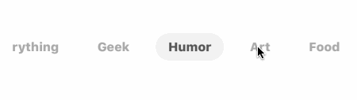

# PinterestSegment
>  A Pinterest-like segment control with masking animation.

[![Swift Version][swift-image]][swift-url]
[](https://raw.githubusercontent.com/TBXark/PinterestSegment/master/LICENSE)
[](http://cocoapods.org/?q=PinterestSegment)
[](http://cocoapods.org/?q=PinterestSegment)
[](https://github.com/Carthage/Carthage)
[](https://www.apple.com/nl/ios/)




## Requirements

- iOS 8.0+
- Xcode 9.0
- Swift 4.0

## Installation

#### CocoaPods
You can use [CocoaPods](http://cocoapods.org/) to install `PinterestSegment` by adding it to your `Podfile`:

```ruby
platform :ios, '8.0'
use_frameworks!
pod 'PinterestSegment'
```

To get the full benefits import `PinterestSegment` wherever you import UIKit

```swift
import UIKit
import PinterestSegment
```
#### Carthage
Create a `Cartfile` that lists the framework and run `carthage update`. Follow the [instructions](https://github.com/Carthage/Carthage#if-youre-building-for-ios) to add `$(SRCROOT)/Carthage/Build/iOS/PinterestSegment.framework` to an iOS project.

```ruby
github "tbxark/PinterestSegment"
```
#### Manually
1. Download and drop ```PinterestSegment.swift``` in your project.  
2. Congratulations!  

## Usage example

``` swift
let  style = PinterestSegmentStyle()

style.indicatorColor = UIColor(white: 0.95, alpha: 1)
style.titleMargin: CGFloat = 15
style.titlePendingHorizontal: CGFloat = 14
style.titlePendingVertical: CGFloat = 14
style.titleFont = UIFont.boldSystemFont(ofSize: 14)
style.normalTitleColor = UIColor.lightGray
style.selectedTitleColor = UIColor.darkGray

let segment = PinterestSegment(frame: CGRect(x: 20, y: 200, width: w - 40, height: 40), style: style, titles: ["Everything", "Geek", "Humor", "Art", "Food", "Home", "DIY", "Wemoent' Style", "Man's Style", "Beauty", "Travel"])

segment.valueChange = { index in
  // Do something here
}

```

## Article
  
  Fix automaticallyAdjustsScrollViewInsets bug in PinterestSegment [http://tbxark.site/2016/12/08/2016-12-08-Swift-Pinterst/](http://tbxark.site/2016/12/08/2016-12-08-Swift-Pinterst/)

## Release History

* 1.2.0
  support swift 4.0

* 1.0.1
  fix bug

* 1.0.0
  first commit


## Contribute

We would love for you to contribute to **PinterestSegment**, check the ``LICENSE`` file for more info.

## Meta

TBXark – [@tbxark](https://twitter.com/tbxark) – tbxark@outlook.com

Distributed under the MIT license. See ``LICENSE`` for more information.

[https://github.com/TBXark](https://github.com/TBXark)

[swift-image]:https://img.shields.io/badge/swift-3.0-orange.svg
[swift-url]: https://swift.org/
[license-image]: https://img.shields.io/badge/License-MIT-blue.svg
[license-url]: LICENSE
[travis-image]: https://img.shields.io/travis/dbader/node-datadog-metrics/master.svg?style=flat-square
[travis-url]: https://travis-ci.org/dbader/node-datadog-metrics
[codebeat-image]: https://codebeat.co/badges/c19b47ea-2f9d-45df-8458-b2d952fe9dad
[codebeat-url]: https://codebeat.co/projects/github-com-vsouza-awesomeios-com
