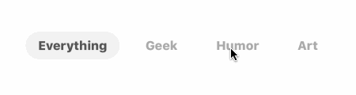
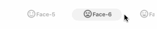

# PinterestSegment

A Pinterest-like segment control with a sliding masking animation, for UIKit and SwiftUI.



[]()
[]()
[]()
[](https://raw.githubusercontent.com/TBXark/PinterestSegment/master/LICENSE)

## Features

- Pinterest-style segment control: an indicator capsule slides between titles while the selected title color is revealed through a mask
- Horizontally scrollable, so any number of titles works
- Optional leading icons per title
- Configurable style: fonts, colors, spacing, minimum item width, borders
- UIKit implementation built on `UIControl` (`@IBDesignable` / `@IBInspectable` support)
- Native SwiftUI implementation with a `Binding`-driven API
- Light and dark mode support (SwiftUI defaults are adaptive)



## Requirements

- iOS 13.0+
- Swift 5.9+ / Xcode 15+

## Installation

### Swift Package Manager

In Xcode, select **File > Add Package Dependencies...** and enter the repository URL:

```
https://github.com/TBXark/PinterestSegment.git
```

Or add it to your `Package.swift`:

```swift
dependencies: [
    .package(url: "https://github.com/TBXark/PinterestSegment.git", from: "2.0.0")
]
```

### CocoaPods

```ruby
pod 'PinterestSegment', '~> 2.0'
```

## Usage

### UIKit

```swift
import UIKit
import PinterestSegment

var style = PinterestSegmentStyle()
style.indicatorColor = UIColor(white: 0.95, alpha: 1)
style.titleMargin = 15
style.titleFont = .boldSystemFont(ofSize: 14)
style.normalTitleColor = .lightGray
style.selectedTitleColor = .darkGray

let segment = PinterestSegment(frame: CGRect(x: 20, y: 100, width: 335, height: 40),
                               segmentStyle: style,
                               titles: ["Everything", "Geek", "Humor", "Art", "Food", "Home", "DIY"])
segment.valueChange = { index in
    // Called when the selection changes
}

view.addSubview(segment)

// Select programmatically. The `valueChange` callback and `.valueChanged`
// action are only sent when the index actually changes.
segment.setSelectIndex(index: 3, animated: true)
```

Titles with a leading icon use `PinterestSegment.TitleElement`:

```swift
let symbols = ["face.smiling", "heart", "star"]
let titles = symbols.map { symbolName in
    let image = UIImage(systemName: symbolName)
    return PinterestSegment.TitleElement(title: symbolName,
                                         selectedImage: image?.withTintColor(.darkGray, renderingMode: .alwaysOriginal),
                                         normalImage: image?.withTintColor(.lightGray, renderingMode: .alwaysOriginal))
}
segment.setRichTextTitles(titles)
```

`PinterestSegment` also works in Interface Builder: add a `UIView`, set its class to `PinterestSegment`, and edit the `@IBInspectable` style properties in the attributes inspector.

#### Notes

- `PinterestSegmentStyle` is a value type. Assigning a whole style (`segment.style = newStyle`) reloads the control automatically. Mutating a property in place (`segment.style.titleFont = font`) does **not**; call `segment.reloadData()` afterwards.
- `valueChange` / `sendActions(for: .valueChanged)` fire only when the selected index changes, including taps and programmatic `setSelectIndex(index:animated:)` calls. Initializing, reloading data, or setting the same index never fires the event.

### SwiftUI

The SwiftUI implementation is native (no UIKit bridging), with an API designed for SwiftUI: the selection is a `Binding` and data changes drive the view.

```swift
import SwiftUI
import PinterestSegment

struct ContentView: View {
    @State private var selection = 0

    var body: some View {
        PinterestSegmentPicker(selection: $selection,
                               titles: ["Everything", "Geek", "Humor", "Art", "Food", "Home", "DIY"])
            .frame(height: 40)
    }
}
```

Items with a leading icon and a custom style:

```swift
var body: some View {
    PinterestSegmentPicker(selection: $selection,
                           items: [
                               .init(title: "Face-1", icon: Image(systemName: "face.smiling")),
                               .init(title: "Face-2", icon: Image(systemName: "heart")),
                           ],
                           style: style,
                           onSelectionChange: { index in ... })
}
```

## Customization

UIKit styles use `PinterestSegmentStyle` (UIColor / UIFont based); SwiftUI uses
`PinterestSegmentPicker.Style` (Color / Font based). The available options
match one-to-one: indicator color, title colors, font, item margin, item
padding, minimum item width, and capsule borders. See the type documentation
for the full list.

## Demo

The demo app shows the UIKit and SwiftUI implementations side by side in two
tabs. It is generated with [XcodeGen](https://github.com/yonaskolb/XcodeGen):

```shell
./Scripts/demo.sh
```

or

```shell
make demo
```

Run the tests with:

```shell
make test
```

## Release History

* 2.0
  - Swift Package Manager with a native SwiftUI implementation, bug fixes
* 1.2.4
  - support swift 4.2
* 1.2.0
  - support swift 4.0
* 1.0.1
  - fix bug
* 1.0.0
  - first commit

## License

Distributed under the MIT license. See `LICENSE` for more information.
